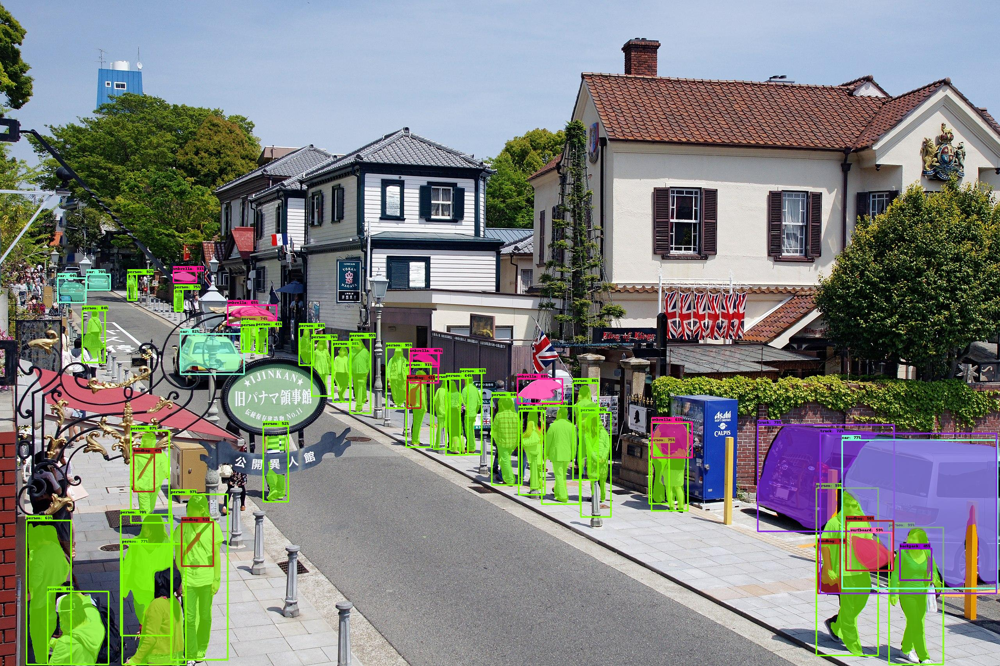

# Projeto de Portfólio: Segmentação de Imagem com Mask R-CNN

Este projeto demonstra a aplicação de um modelo pré-treinado **Mask R-CNN** para **detecção de objetos e segmentação de instâncias** em imagens.

## Visão Geral

O objetivo principal é exibir a capacidade do modelo em identificar e segmentar objetos pixel a pixel, além de mostrar a configuração e execução de modelos de Deep Learning no ambiente do **Google Colab**, incluindo a gestão de compatibilidade com **TensorFlow 1.x em ambiente 2.x** e o uso de **TPUs/GPUs**.

## Resultado Exemplo

A imagem abaixo ilustra a performance do modelo em um cenário urbano, destacando a detecção de pedestres e veículos com suas respectivas máscaras de segmentação:

### Kitano Street, Kobe

## Tecnologias Utilizadas

* `TensorFlow` (com `tf.compat.v1`)
* `Pillow`
* `NumPy`
* `OpenCV-Python`
* `IPython.display`

## Contato

Conecte-se comigo no [LinkedIn](SEU_LINK_DO_LINKEDIN_AQUI)!
